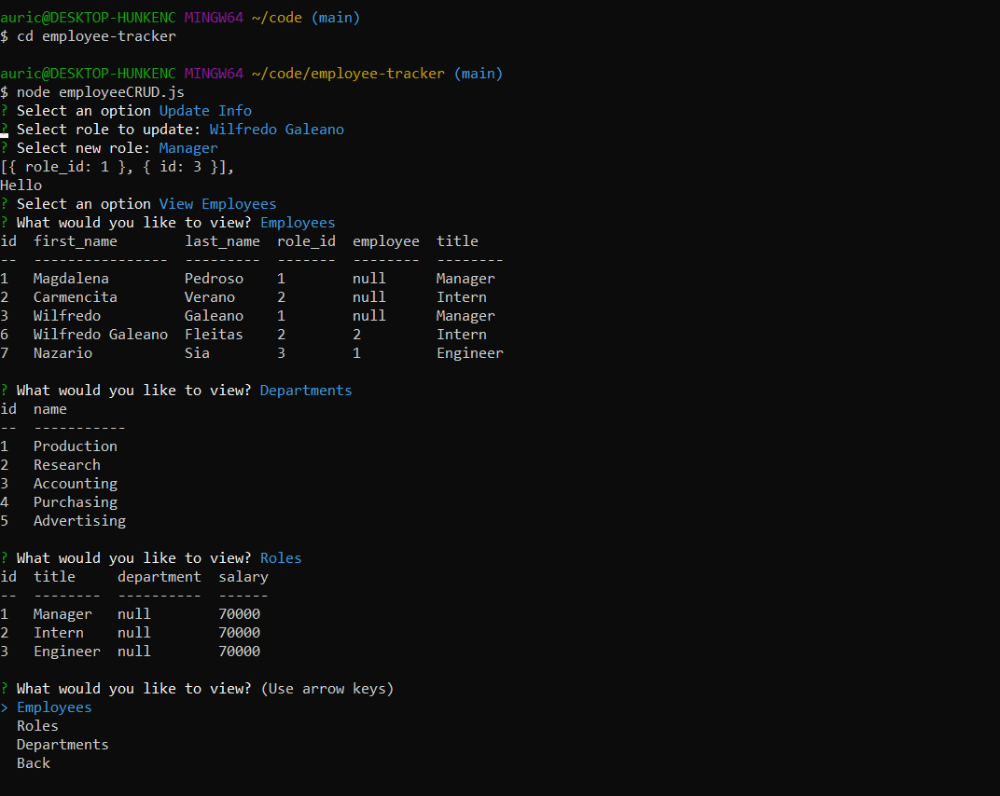

# employee-tracker

## Description

Welcome to a Content Management System based employee directory. View and track department, roles, and employees, along with corresponding data via this command line application. 

* Add departments, roles, employees

* View departments, roles, employees

* Update employee roles

* Update employee managers

* View employees by manager

* Delete departments, roles, and employees

* View the total utilized budget of a department -- ie the combined salaries of all employees in that department

## Screenshot

## Technologies

Node, Inquirer, MYSQL

## Links 

* Demo: https://drive.google.com/file/d/1b7FCZf3rQ91wtzBGU-rHYoALklShhFiD/view?usp=sharing

* Github: https://github.com/guaaur04/employee-tracker

## License

© 2021 
Auricia V Guardado

=====

## Learning Objectives 